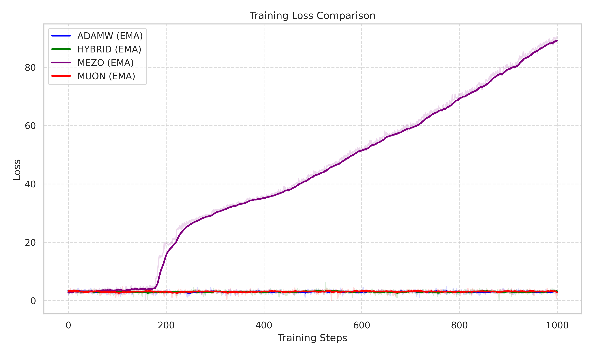
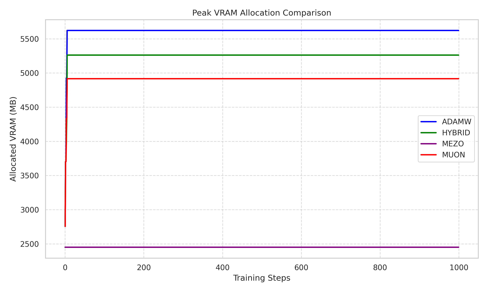

# Qwen2.5-0.5B Fine-Tuning Comparison

This project compares different optimization strategies for full fine-tuning of the Qwen2.5-0.5B model on the `openwebtext-100k` dataset. We evaluate AdamW, Muon (Momentum Orthogonalizer), a Hybrid approach, and MeZO (Zeroth-Order Optimizer).

## Project Structure
- `src/models/`: Implementation of Muon, Hybrid, and MeZO optimizers.
- `src/training/`: Training pipeline using Hugging Face Transformers and Accelerate.
- `src/data/`: Dataset loading and efficient tokenization.
- `scripts/`: Bash scripts for reproduction and metric plotting.
- `report/`: LaTeX source and figures for the final report.

## Setup
1. Install `uv` if not already present.
2. Initialize environment and install all dependencies:
```bash
uv sync
```

## Reproducing Experiments
To run all experiments (AdamW, Muon, Hybrid, MeZO) and generate the report data:

### 1. Run All Training and Evaluation
```bash
chmod +x scripts/run_eval.sh
./scripts/run_eval.sh
```
*Note: The script includes AdamW, Muon, and Hybrid. MeZO training should be run separately due to the high number of steps.*

### 2. Run MeZO (Challenge)
```bash
python -m src.training.trainer --optimizer mezo --lr 1e-6 --max_steps 15000
```

### 3. Generate Loss Plots
```bash
uv run python scripts/plot_metrics.py
```

## Evaluation Results

Detailed results are summarized in the [LaTeX report](report/main.tex) and saved as JSON files in the `results/` directory.

### Training Loss Comparison


### VRAM Memory Profiling


| Optimizer | Peak VRAM (MB) |
| :--- | :---: |
| **ADAMW** | 5623 |
| **HYBRID** | 5262 |
| **MUON** | 4917 |
| **MEZO** | **2452** |

### Performance Table (Zero-shot Accuracy)
| Benchmark | Baseline | AdamW | Muon | Hybrid | MeZO (15k) |
| :--- | :---: | :---: | :---: | :---: | :---: |
| **ARC-Challenge** | **32.08%** | 31.65% | 25.34% | 23.98% | 26.71% |
| **ARC-Easy** | 58.33% | **61.70%** | 38.97% | 26.98% | 25.63% |
| **HellaSwag** | **52.10%** | 51.82% | 34.55% | 25.79% | 26.01% |
| **PIQA** | 69.91% | **70.13%** | 58.97% | 51.90% | 49.95% |
| **WinoGrande** | 56.11% | **57.93%** | 51.06% | 50.51% | 49.41% |

### Key Findings
- **AdamW** preserves pre-trained knowledge and shows slight improvements on logical reasoning tasks.
- **Muon** and the **Hybrid** approach lead to catastrophic forgetting during fine-tuning, as aggressive orthogonalization disrupts pre-trained representations.
- **MeZO** (zeroth-order) requires significantly more steps to converge in high-dimensional spaces but is extremely memory-efficient (~2.5GB VRAM).

### Training Logs
Detailed CSV logs for every training step (loss, learning rate, and time) are available in the `logs/` directory for all optimizers.

## Code Style
We use `ruff` for linting and code quality checks.
```bash
uv run ruff check .
```
