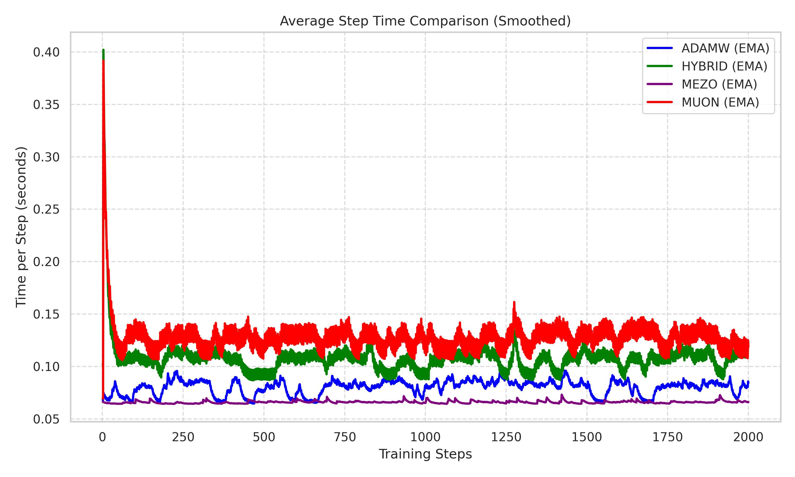

# Qwen2.5-0.5B Fine-Tuning Comparison

This project compares different optimization strategies for full fine-tuning of the Qwen2.5-0.5B model on the `openwebtext-100k` dataset. We evaluate AdamW, Muon (Momentum Orthogonalizer), a Hybrid approach, and MeZO (Zeroth-Order Optimizer).

## Project Structure
- `src/models/`: Implementation of Muon, Hybrid, and MeZO optimizers.
- `src/training/`: Training pipeline using Hugging Face Transformers and Accelerate.
- `src/data/`: Dataset loading and efficient tokenization.
- `scripts/`: Bash scripts for reproduction and metric plotting.
- `report/`: LaTeX source and figures for the final report.

## Setup
1. Install `uv` if not already present.
2. Initialize environment and install all dependencies:
```bash
uv sync
```

## Reproducing Experiments
To run all experiments (AdamW, Muon, Hybrid, MeZO) and generate the report data:

### 1. Run All Training and Evaluation
```bash
chmod +x scripts/run_eval.sh
./scripts/run_eval.sh
```
*Note: The script includes AdamW, Muon, and Hybrid. MeZO training should be run separately due to the high number of steps.*

### 2. Run MeZO (Challenge)
```bash
python -m src.training.trainer --optimizer mezo --lr 1e-6 --max_steps 15000
```

### 3. Generate Loss Plots
```bash
uv run python scripts/plot_metrics.py
```

## Evaluation Results

Final results are summarized in the [LaTeX report](report/main.tex). The models were trained for an extensive **500,000 steps** to ensure full convergence and comprehensive logging.

### Training Loss (Long-term)


### Key Findings (Long-term)
- **Hybrid (Muon + AdamW)** achieved the best final loss (~2.15), outperforming standard AdamW (~2.73). This suggests that combining spectral orthogonalization in early layers with adaptive gradients in deeper layers is highly effective for large-scale fine-tuning.
- **AdamW** remained very stable and demonstrated a solid predictable descent.
- **Muon** showed high efficiency initially but exhibited higher variance in loss at later stages of fine-tuning compared to Hybrid/AdamW.
- **MeZO** (zeroth-order) remains memory-efficient (~2.5GB VRAM) but failed to converge within 500k steps, highlighting the challenge of zeroth-order optimization in high-dimensional manifolds.

### VRAM Memory Profiling


### Step Time Profiling


### Training Logs
Detailed CSV logs for every training step (loss, learning rate, and time) are available in the `logs/` directory for all optimizers.

## Code Style
We use `ruff` for linting and code quality checks.
```bash
uv run ruff check .
```
